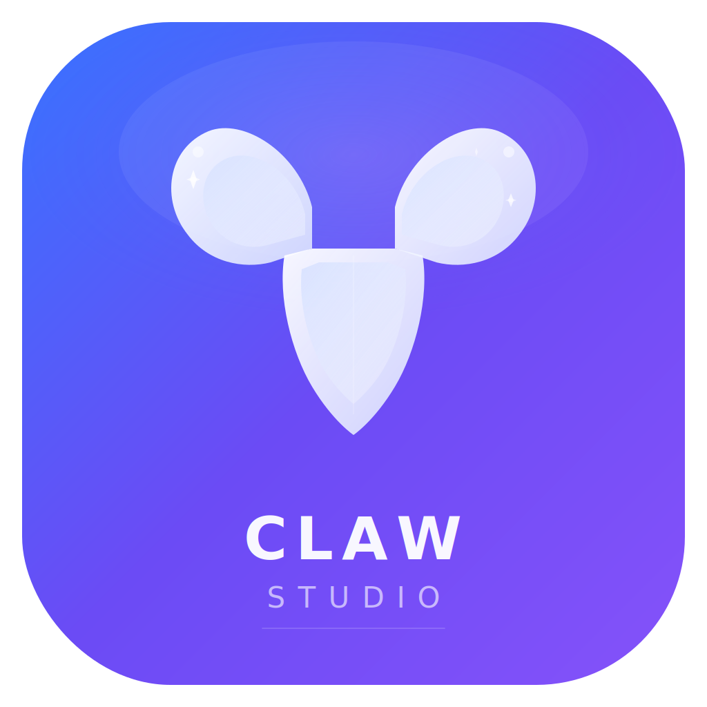

<p align="center">
  
</p>

<h1 align="center">Claw Studio</h1>

<p align="center">
  <strong>The Ultimate Agent Operating System for macOS</strong>
</p>

<p align="center">
  A fully native Swift + SwiftUI application that transforms <a href="https://github.com/openclaw/openclaw">OpenClaw</a> from a command-line runtime into a visual, multi-agent orchestration studio. Built without Xcode. Signed and notarized by Apple.
</p>

<p align="center">
  <a href="https://github.com/Worth-Doing/claw-studio/releases/latest"></a>
  
  
  
  
</p>

<p align="center">
  <a href="#-download--install">Download</a> &bull;
  <a href="#-what-is-claw-studio">What is it</a> &bull;
  <a href="#-architecture">Architecture</a> &bull;
  <a href="#-features">Features</a> &bull;
  <a href="#-build-from-source">Build from Source</a> &bull;
  <a href="#-credits">Credits</a>
</p>

---

## Download & Install

### One-Click Install

> **[Download Claw Studio v1.0.0 (.dmg)](https://github.com/Worth-Doing/claw-studio/releases/latest)**

1. Download the `.dmg` file from the link above
2. Open the DMG — drag **Claw Studio** into your **Applications** folder
3. Launch from Launchpad or Spotlight

**No Gatekeeper warnings.** The app is signed with an Apple Developer ID certificate and notarized by Apple's notary service. macOS will confirm `source=Notarized Developer ID` on first launch.

### Prerequisites

Claw Studio requires the [OpenClaw](https://github.com/openclaw/openclaw) runtime installed on your machine:

```bash
npm install -g openclaw@latest
```

That's it. Claw Studio auto-detects the `openclaw` binary and bridges every CLI operation through its native interface — you never need to touch the terminal again.

---

## What is Claw Studio

Traditional AI tools give you a single chat window with a single model. Claw Studio gives you an **operating system for AI agents**.

Claw Studio wraps the open-source [OpenClaw](https://github.com/openclaw/openclaw) runtime — a powerful, multi-agent AI framework — inside a pristine native macOS application. Instead of memorizing CLI commands, piping JSON, and juggling terminal tabs, you get a visual command center where every action is a button click, every configuration is a form field, and every output streams live into the app.

### The Problem

OpenClaw is incredibly powerful. It supports 835+ AI models from 15+ providers, 52 bundled skills, 22 messaging channels, multi-agent routing, persistent memory, and more. But all of that power lives behind a CLI. To use it, you need to:

- Remember dozens of `openclaw` subcommands
- Manually edit JSON config files
- Export API keys in your shell profile
- Parse table-formatted terminal output
- Switch between multiple terminal windows

### The Solution

Claw Studio takes every single one of those CLI operations and puts it behind a native macOS interface:

| CLI Command | Claw Studio Equivalent |
|---|---|
| `openclaw config set env.vars.ANTHROPIC_API_KEY sk-...` | Paste key in a SecureField, click **Save** |
| `openclaw models list --all --json` | Browse 835 models with search, filter, one-click default |
| `openclaw channels add --channel telegram --token ...` | Paste bot token, click **Connect Telegram** |
| `openclaw skills list` | Visual skill cards with ready/needs-setup badges |
| `openclaw skills install some-skill` | Click **Setup** on the skill card |
| `openclaw doctor` | Click **Run Doctor**, see output in embedded terminal |
| `openclaw gateway --port 18789` | Click **Start Gateway**, watch logs stream |
| `openclaw agent --message "..." --thinking high` | Type message, pick thinking level, hit Send |
| `openclaw status` | Visual dashboard with hero status cards |

**Zero CLI knowledge required.** Every action runs inside the app. Every result appears in the app. You never open Terminal.

---

## Architecture

### System Design

```
+------------------------------------------------------------------+
|                         Claw Studio.app                           |
|                                                                   |
|   +-------------------+    +----------------------------------+   |
|   |    SwiftUI Views  |    |          AppState                |   |
|   |                   |    |   (Central @Observable store)    |   |
|   |   - ChatView      |    +----------------------------------+   |
|   |   - GatewayView   |                  |                        |
|   |   - APIKeysView   |                  v                        |
|   |   - ModelBrowser  |    +----------------------------------+   |
|   |   - Integrations  |    |       OpenClawBridge             |   |
|   |   - Skills        |    |   (Process() + stdin/stdout)     |   |
|   |   - Filesystem    |    +----------------------------------+   |
|   |   - Memory        |                  |                        |
|   |   - Monitoring    |                  v                        |
|   |   - Settings      |    +----------------------------------+   |
|   |                   |    |       CommandRunner               |   |
|   +-------------------+    |   (Live terminal execution)      |   |
|                            +----------------------------------+   |
|                                          |                        |
+------------------------------------------|-----------------------+
                                           |
                               Swift Process() bridge
                                           |
                                           v
                              +------------------------+
                              |   openclaw CLI binary   |
                              |   (Node.js runtime)     |
                              +------------------------+
                                           |
                              +------------+------------+
                              |            |            |
                              v            v            v
                          AI Models    Channels     Skills
                         (835+ from   (WhatsApp,   (52 bundled,
                          15+ provs)   Telegram,    ClawHub
                                       Discord...)  registry)
```

### Technology Stack

| Layer | Technology |
|---|---|
| **Language** | Swift 6.3 |
| **UI Framework** | SwiftUI (macOS 14+) |
| **Build System** | Swift Package Manager (no Xcode required) |
| **Engine Bridge** | `Foundation.Process()` with stdin/stdout pipes |
| **Runtime** | OpenClaw (Node.js) |
| **Design System** | Custom "Glass UI" light theme |
| **Signing** | Developer ID Application (Apple) |
| **Notarization** | Apple Notary Service |
| **Architecture** | arm64 (Apple Silicon native) |

### Project Structure

```
claw-studio/
├── Package.swift                          # SPM manifest (macOS 14+)
├── build-app.sh                           # Build + bundle script
├── Resources/
│   ├── ClawStudioLogo.svg                 # App logo (original design)
│   ├── AppIcon.icns                       # macOS icon (all sizes)
│   ├── Info.plist                         # App bundle metadata
│   └── entitlements.plist                 # Hardened runtime entitlements
└── Sources/ClawStudio/
    ├── ClawStudioApp.swift                # @main entry point
    ├── Models/
    │   └── Models.swift                   # All data models
    ├── Services/
    │   ├── AppState.swift                 # Central state management
    │   ├── OpenClawBridge.swift           # Engine bridge + CLI wrapper
    │   └── CommandRunner.swift            # Live in-app terminal execution
    ├── Theme/
    │   └── GlassTheme.swift              # Complete design system
    └── Views/
        ├── ContentView.swift              # Main shell + sidebar
        ├── APIKeysView.swift              # Provider auth management
        ├── GatewayView.swift              # Engine + gateway control
        ├── IntegrationsView.swift         # Channels + skills + ClawHub
        ├── ModelBrowserView.swift         # 835-model browser
        ├── SettingsView.swift             # App settings
        ├── Chat/ChatView.swift            # Agent chat interface
        ├── Sessions/SessionManagerView.swift
        ├── Agents/AgentConfigView.swift   # Multi-agent orchestration
        ├── Skills/SkillsManagerView.swift
        ├── Filesystem/FilesystemView.swift
        ├── Memory/MemoryManagerView.swift
        └── Monitoring/MonitoringView.swift
```

---

## Features

### 12-Panel Navigation

Claw Studio organizes its entire interface into three sections with 12 dedicated panels:

#### Workspace

| Panel | Description |
|---|---|
| **Chat** | Primary agent interaction surface. Message input with thinking-level selector (Low/Medium/High), streaming responses, tool call inspection, thinking panel sidebar. Welcome screen with quick-action cards. |
| **Sessions** | Full session lifecycle management. Create, resume, delete sessions. Stats dashboard showing total sessions, running count, message volume, token usage. Filter by status, search by name. |
| **Agents** | Multi-agent orchestration center. Create agents with custom roles, models, icons. Edit `SOUL.md` (personality/boundaries) and `AGENTS.md` (operational instructions) directly in the app. Visual pipeline graph editor for agent-to-agent workflows. |

#### OpenClaw Engine

| Panel | Description |
|---|---|
| **Gateway** | Full engine management dashboard. Hero status cards (Engine / Gateway / Service / Security). 8 quick-action buttons: Start Gateway, Run Doctor, Setup Wizard, Security Audit, Health Check, Open Dashboard, View Logs, Check Updates. Live terminal output panel with command history. |
| **API Keys** | Provider authentication center. 15 providers with individual configuration: Anthropic, OpenAI, Google AI, OpenRouter, Groq, Mistral, Perplexity, Together AI, Fireworks, DeepSeek, xAI, Cohere, GitHub Copilot, Amazon Bedrock, Azure OpenAI. SecureField key input, one-click save to OpenClaw config, real-time status detection, auth flow launcher, provider dashboard links. |
| **Models** | Full model browser. Loads all 835+ models from `openclaw models list --all --json`. Filter by provider, search by name/key, toggle available-only. Set default model with one click. Model detail panel with context window, input type, tags, config snippets. |
| **Integrations** | Three sub-tabs: **Channels** (22 messaging platforms with connect/login/status/disconnect buttons), **Skills** (52 bundled skills with status badges and setup buttons), **ClawHub** (search and install community skills). Every action runs in-app. |
| **Skills** | Secondary skill manager with category filtering, toggle-based activation, and API key association. |

#### System

| Panel | Description |
|---|---|
| **Files** | Live workspace filesystem explorer. Tree view with expand/collapse. File content viewer with syntax-appropriate icons. Path bar for custom workspace locations. |
| **Memory** | Three-tier memory system browser: Short-Term (session context), Long-Term (persistent knowledge), Episodic (historical events). Direct `MEMORY.md` editor with save/reload. Search and filter by type. |
| **Monitoring** | Real-time analytics dashboard. Token usage by agent (bar chart), cost breakdown by model, system resource gauges (CPU/Memory/Processes), live activity log with event types. |
| **Settings** | Five sub-panels: General (workspace, defaults, behavior), Engine (connection status, version, API keys overview), Appearance (theme preview, color swatches), Diagnostics (in-app `openclaw doctor`), About. |

### Supported Channels (22)

| Channel | Type |
|---|---|
| WhatsApp | Session login |
| Telegram | Bot token |
| Discord | Bot token |
| Slack | Bot token |
| Signal | Session login |
| iMessage | Native bridge |
| BlueBubbles | iMessage bridge |
| IRC | Connection config |
| Microsoft Teams | Bot token |
| Matrix / Element | Connection config |
| Google Chat | Integration |
| Feishu / Lark | Integration |
| LINE | Integration |
| Mattermost | Bot token |
| Nextcloud Talk | Integration |
| Nostr | Protocol |
| Synology Chat | Integration |
| Twitch | Chat integration |
| Zalo | Integration |
| WeChat | Integration |
| QQ | Integration |
| WebChat | Widget |

### Supported AI Providers (15)

| Provider | Env Variable | Models |
|---|---|---|
| Anthropic | `ANTHROPIC_API_KEY` | Claude Opus 4.6, Sonnet 4.6, Haiku 4.5 |
| OpenAI | `OPENAI_API_KEY` | GPT-5.4, GPT-4o, o1, o3 |
| Google AI | `GOOGLE_API_KEY` | Gemini 2.5 Pro/Flash |
| OpenRouter | `OPENROUTER_API_KEY` | 600+ models aggregated |
| Groq | `GROQ_API_KEY` | LLaMA, Mixtral (ultra-fast) |
| Mistral | `MISTRAL_API_KEY` | Mistral Large, Medium, Small |
| Perplexity | `PERPLEXITY_API_KEY` | Sonar models |
| Together AI | `TOGETHER_API_KEY` | Open-source models |
| Fireworks AI | `FIREWORKS_API_KEY` | Fast inference |
| DeepSeek | `DEEPSEEK_API_KEY` | DeepSeek V3/R1 |
| xAI (Grok) | `XAI_API_KEY` | Grok models |
| Cohere | `COHERE_API_KEY` | Command R+ |
| GitHub Copilot | `GITHUB_TOKEN` | Copilot models |
| Amazon Bedrock | `AWS_ACCESS_KEY_ID` | AWS-hosted models |
| Azure OpenAI | `AZURE_OPENAI_API_KEY` | Azure-hosted OpenAI |

### Design System: Glass UI (Light)

The interface uses a custom-built light "Glass UI" design language:

- **Surfaces** — White cards with subtle depth shadows, not flat material
- **Accent palette** — Electric blue `#3873FF`, rich violet `#8552FA`, teal mint `#00C7B8`
- **Typography** — SF Pro system font with careful weight hierarchy
- **Cards** — White backgrounds with `0.08` opacity borders and multi-layer shadows
- **Terminal blocks** — Dark backgrounds (`#1E1E28`) for code/output readability contrast
- **Badges** — Capsule-shaped with tinted backgrounds matching accent colors
- **Gradients** — Soft lavender-blue background gradient across the main content area

---

## Build from Source

### Prerequisites

- **macOS 14.0+** (Sonoma or later)
- **Swift 6.0+** (included with Xcode Command Line Tools)
- **Node.js 22.16+** (for OpenClaw runtime)
- **OpenClaw** (`npm install -g openclaw@latest`)

### Build

```bash
# Clone the repository
git clone https://github.com/Worth-Doing/claw-studio.git
cd claw-studio

# Install OpenClaw if you haven't
npm install -g openclaw@latest

# Build (debug)
swift build

# Build (release) + create .app bundle
chmod +x build-app.sh
./build-app.sh

# Launch
open "Claw Studio.app"
```

### Build & Sign (for distribution)

```bash
# Build release
swift build -c release

# Create bundle
mkdir -p "Claw Studio.app/Contents/MacOS"
mkdir -p "Claw Studio.app/Contents/Resources"
cp .build/release/ClawStudio "Claw Studio.app/Contents/MacOS/ClawStudio"
cp Resources/AppIcon.icns "Claw Studio.app/Contents/Resources/AppIcon.icns"
cp Resources/Info.plist "Claw Studio.app/Contents/Info.plist"

# Sign with your Developer ID
codesign --force --deep --sign "Developer ID Application: Your Name (TEAM_ID)" \
    --entitlements Resources/entitlements.plist \
    --options runtime --timestamp \
    "Claw Studio.app"

# Create DMG
hdiutil create -volname "Claw Studio" -srcfolder "Claw Studio.app" \
    -ov -format UDZO ClawStudio.dmg

# Sign DMG
codesign --force --sign "Developer ID Application: Your Name (TEAM_ID)" \
    --timestamp ClawStudio.dmg

# Notarize
xcrun notarytool submit ClawStudio.dmg \
    --apple-id "you@email.com" --team-id "TEAM_ID" --wait

# Staple
xcrun stapler staple ClawStudio.dmg
```

---

## How It Works

### The Bridge Pattern

Claw Studio doesn't embed a Node.js runtime or reimplement OpenClaw. Instead, it uses Swift's `Foundation.Process()` to spawn the `openclaw` CLI binary and communicate via stdin/stdout pipes. This means:

1. **Always up to date** — Update OpenClaw with `npm update -g openclaw`, and Claw Studio immediately uses the latest version
2. **No dependency conflicts** — The Swift app and Node.js runtime are completely isolated
3. **Full CLI parity** — Every `openclaw` command is available through the bridge
4. **Secure** — Keys are stored in OpenClaw's own config, not in the app

### CommandRunner

The `CommandRunner` service is the backbone of in-app execution. When you click any action button:

1. It spawns a `Process()` with the appropriate `openclaw` arguments
2. Captures stdout and stderr through pipes
3. Streams output into a `LiveTerminalView` component
4. Tracks exit codes, timing, and command history
5. Updates the UI reactively via `@Published` properties

This is why you never need to open Terminal — every CLI interaction happens inside the app with live feedback.

---

## Credits

- **[OpenClaw](https://github.com/openclaw/openclaw)** — The open-source AI agent runtime that powers everything under the hood. Created by Peter Steinberger.
- **[WorthDoing AI](https://worthdoing.ai)** — App design, development, and distribution.
- Built entirely with **Swift** and **SwiftUI** — no Xcode project files, no storyboards, no Interface Builder. Pure Swift Package Manager.

---

## License

MIT License. See [LICENSE](LICENSE) for details.

---

<p align="center">
  <sub>Built with precision by <a href="https://worthdoing.ai">WorthDoing AI</a></sub>
</p>
